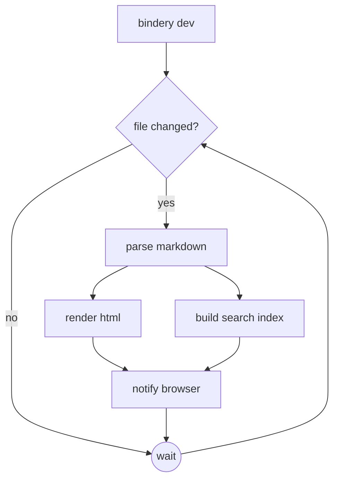

# Getting started

Point `bindery` at a directory of Markdown:

```bash
bindery dev ./docs
```

The dev server watches the directory and reloads the browser on save.

## How the dev server works



The watcher polls, because Go's standard library has no file-watching API.
Changes are debounced so that one save means one rebuild.

## Building

```bash
bindery build ./docs --out ./site
```

The output is plain HTML with no JavaScript at all: the live-reload client is
injected by `dev` and never by `build`.

## What it does not do

* No configuration file
* No plugins
* No JavaScript in published output

## Embedding

`bindery` is a single package, so the parser can be used directly:

```go
package main

import "fmt"

// render turns Markdown into HTML.
func render(src string) string {
	doc := Parse(src)          // two passes: blocks, then inlines
	return RenderHTML(doc)     // specification-shaped output
}

func main() {
	fmt.Println(render("# Hello *world*"))
}
```

The same document renders three ways:

```bash
bindery render page.md --format html   # HTML
bindery render page.md --format ansi   # terminal
bindery render page.md --format json   # the syntax tree
```
