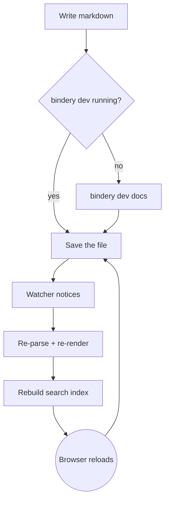

# Everything on one page

This page exists for one reason: to put every capability of **bindery** in
front of you in a single scroll, rendered by a binary with an empty dependency
manifest. Nothing below required a package.

Use the search box in the sidebar — press `/` — to jump straight to
"WebSocket" or "BM25" or "Sugiyama" and watch the ranking work.

## Text, the way CommonMark defines it

A paragraph can carry *emphasis*, **strong emphasis**, ***both at once***, and
`inline code`, mixed freely — *this is **nested** on purpose*. A backslash
escapes stray punctuation like \*this\*, and a named entity such as &mdash;
resolves through the standard library's own HTML tables, not a hand-built
lookup table.

Two spaces at the end of a line force a hard break,
landing here on the next line rather than merging into one.

> Blockquotes nest as deep as you're willing to read them.
>
> > A second voice, quoted inside the first.
> >
> > > And a third — CommonMark's containers compose exactly like a tree,
> > > because that's what they are.

---

## Lists, tight and loose

A short, tight list — no blank lines between items, so no wrapping `<p>` tags:

- Point one
- Point two
- Point three

The same shape, but loose, because a blank line separates the items:

- A point with room to breathe.

- A second point, its own paragraph.

- And a third, holding a nested list of its own:
  1. Ordered items count themselves
  2. Starting from whatever number the first one names
  3. Nesting as many levels as the document needs
     - back to bullets
     - a level deeper still

## Links, images, autolinks

An [inline link with a title](https://commonmark.org "The CommonMark Spec"),
a [reference-style link][spec], a bare autolink <https://go.dev>, and an email
autolink <hello@example.com> — all four link forms CommonMark defines.

[spec]: https://spec.commonmark.org/0.31.2/ "CommonMark 0.31.2"

## Tables

The one construct CommonMark itself has no opinion on — bindery's table
extension, alignment and all:

| Feature          | Status | Standard-library gap it fills          |
|:-----------------|:------:|:----------------------------------------|
| Markdown parsing | done   | no parser in any language's stdlib      |
| Live reload      | done   | no WebSocket in `net/http`              |
| File watching    | done   | no inotify/FSEvents wrapper in Go       |
| Full-text search | done   | no inverted index, obviously            |
| PDF export       | done   | no PDF writer, no font embedding needed |
| Diagrams         | done   | no SVG layout engine                    |

## Syntax highlighting, six lexers deep

```go
// Go: the parser's own container stack, roughly.
func (p *blockParser) incorporateLine(text string) {
	container := p.doc
	for {
		next := openContainerChild(container)
		if next == nil || !p.continueContainer(next, &cursor) {
			break
		}
		container = next
	}
}
```

```javascript
// JavaScript: the client half of search, ranking with BM25.
function search(query) {
  const terms = tokenize(query);
  return Object.keys(scores)
    .map(id => ({ doc: index.docs[id], score: scores[id] }))
    .sort((a, b) => b.score - a.score)
    .slice(0, MAX_HITS);
}
```

```python
# Python: nobody asked, but the lexer handles it anyway.
def tokenize(text: str) -> list[str]:
    return [w.lower() for w in text.split() if len(w) >= 2]
```

```bash
# The only three commands this whole project needs.
bindery dev docs      # live reload while you write
bindery build docs    # static HTML, deploy anywhere
bindery pdf docs      # one document, clickable links
```

```json
{
  "manifest": "empty",
  "dependencies": {},
  "third_party_runtime_code": 0
}
```

```diff
- var mdParser = require("markdown-it")
- var chalk = require("chalk")
+ // hand-written CommonMark parser, 1,600 lines, 652/652 conformance
+ // raw ANSI escapes, honouring NO_COLOR
```

## A diagram, laid out by hand



Layered top to bottom, back edges routed around the side so the loop still
reads as a loop, boxes sized from real Helvetica advance widths — the same
metrics table the PDF writer uses.

## Code spans versus code blocks

A code span like `not-a-real-package` sits inline. A fence keeps its contents
completely literal, markup and all — none of this renders as Markdown:

```text
# not a heading
* not a list
**not bold**
[not a link](nowhere)
```

## Front matter you're looking at right now

This very page opened with:

```yaml
---
title: Feature Showcase
order: 0
---
```

A hand-rolled YAML *subset* — block mappings, sequences, scalars, comments —
because Go's standard library has no YAML at all, and full YAML has anchors,
aliases, and five kinds of block scalar that a docs page will never use.

## Thematic breaks

Three ways to draw the same line:

---
***
___

## What you can't see from here

- **`bindery build`** turns this whole `docs/` folder into static HTML —
  no server required to view it.
- **`bindery pdf`** renders the same content as one PDF, real clickable link
  annotations, byte-identical across builds.
- **`bindery spec`** prints the CommonMark conformance number this parser
  actually earns — not claimed, measured against the official 652 examples.
- **The search box** in the sidebar is ranking every word on this page with
  BM25, computed identically in Go and in about a hundred lines of
  hand-written JavaScript.

Every one of those is a package in a normal project. Here, `go.mod` has no
`require` block at all.
